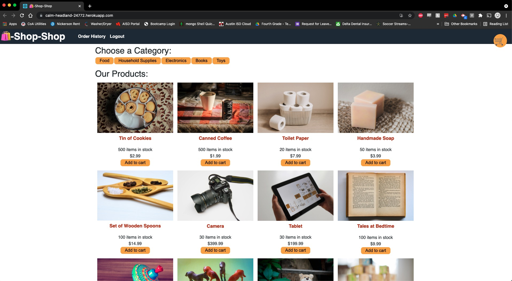
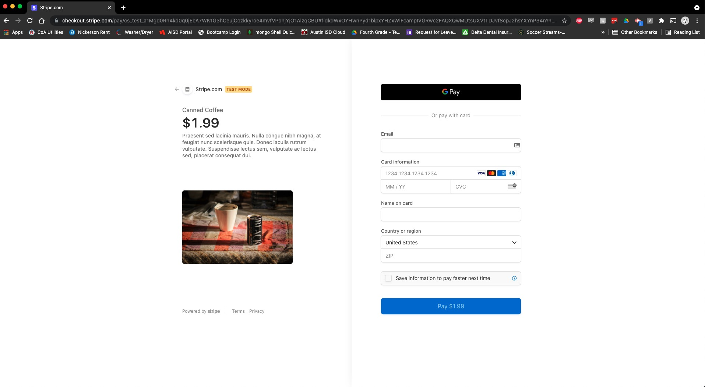

# molina-redux-challenge

  ## Deployed App URL:
  https://calm-headland-24772.herokuapp.com/

  ## Github URL:
  https://github.com/jmol721/molina-redux-challenge

  ## Description
  
  This is an eCommerce site that has been refactored to use Redux to keep track of state.

  ## Table of Contents

  * [Installation](#installation)

  * [Screenshots](#screenshots)

  * [Questions](#questions)

  ## Installation

  To install necessary dependencies, run the following command:

  ```
  npm install
  ```
  
  ## Screenshots
  

  

  ## Questions

  If you have any questions about the repo, contact me directly at jmolina721@gmail.com. You can find more of my work at [jmol721](https://github.com/jmol721/).
